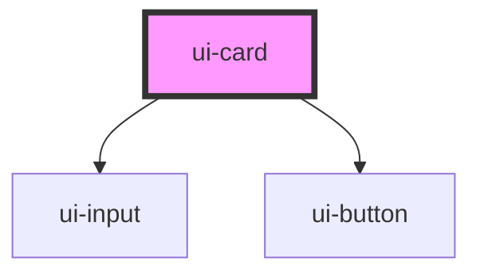

# ui-card

<!-- Auto Generated Below -->

## Properties

| Property     | Attribute     | Description | Type     | Default      |
| ------------ | ------------- | ----------- | -------- | ------------ |
| `imageBack`  | `image-back`  |             | `string` | `'star.png'` |
| `imageFront` | `image-front` |             | `string` | `'star.png'` |

## Dependencies

### Depends on

- [ui-input](../ui-input)
- [ui-button](../ui-button)

### Graph

----------------------------------------------

*Built with [StencilJS](https://stenciljs.com/)*
